# Conversational Outreach Agent

An evaluation-first, human-controlled email agent built with Python, Groq,
FastAPI, Supabase and the Gmail API. It turns inbound email into a traceable
workflow: understand the reply, load context, retrieve evidence, draft a
response, request human approval, execute approved actions, reply in-thread and
measure quality.

> **Token-safe by design:** no model polling loop runs in the background. Groq
> is called only after a Gmail push event, a manual inbound API request, an
> explicit regeneration, or an evaluation command. The default mock mode uses
> zero external API tokens.

## Workflow

```mermaid
flowchart LR
    A[Inbound Gmail] --> B[Authenticate + deduplicate]
    B --> C[Contact + conversation context]
    C --> D[Knowledge retrieval]
    D --> E[Intent + risk extraction]
    E --> F[Grounded reply + action]
    F --> G[Policy + safety checks]
    G --> H[Human approval]
    H --> I[Approved action]
    I --> J[Reply in Gmail thread]
    J --> K[Persistent state + audit]
    K --> L[Feedback + evaluation]
```



The included activity dashboard presents this pipeline as an n8n-style node
graph and shows the events, evidence, risks and decisions for each conversation.

## Distinctive capabilities

- Event-driven processing with no idle LLM consumption.
- Structured Groq outputs validated by Pydantic.
- Provider interfaces for Groq, local/mock AI, Gmail and Supabase.
- Evidence-grounded replies and deterministic policy enforcement.
- Human approve, edit, reject and regenerate controls.
- Tool proposals that cannot execute before approval.
- Gmail event deduplication and conversation-thread continuity.
- Immutable workflow events and a visual activity trace.
- Human corrections captured as evaluation candidates.
- Golden dataset, deterministic assertions and optional LLM-as-judge scoring.

## Quick start — zero-token demo

```powershell
cd D:\documents\ConversationalOutreachAgent
D:\Anaconda\python.exe -m venv .venv
.\.venv\Scripts\Activate.ps1
python -m pip install -e ".[dev]"
Copy-Item .env.example .env
uvicorn outreach_agent.main:app --reload
```

Open <http://localhost:8000>. Keep the default `mock` providers and use **Run
example** to see a complete inbound-to-approval trace without calling Groq or
sending email.

## Enable real integrations

1. Create a Supabase project and run `database/migrations/001_initial.sql`.
2. Create Gmail OAuth desktop/web credentials and complete the OAuth consent
   setup described in `docs/GMAIL_SETUP.md`.
3. Create a Groq API key.
4. Copy `.env.example` to `.env` and set:

```dotenv
AI_PROVIDER=groq
EMAIL_PROVIDER=gmail
STORAGE_PROVIDER=supabase
GROQ_API_KEY=...
SUPABASE_URL=...
SUPABASE_KEY=...
```

Starting the FastAPI service does **not** invoke Groq. Only inbound work does.

## API

- `POST /api/v1/messages/inbound` — submit a normalized inbound message.
- `POST /api/v1/webhooks/gmail` — receive Gmail Pub/Sub notifications.
- `GET /api/v1/conversations` — list conversations.
- `GET /api/v1/conversations/{id}` — conversation and workflow trace.
- `GET /api/v1/approvals` — pending drafts.
- `POST /api/v1/approvals/{id}/approve` — approve or edit and send.
- `POST /api/v1/approvals/{id}/reject` — reject with a reason.
- `POST /api/v1/approvals/{id}/regenerate` — explicitly spend one generation.
- `GET /health` and `GET /ready` — operational probes with no model calls.

Interactive API documentation is available at `/docs`.

## Evaluation

```powershell
# Deterministic zero-token regression run
outreach-eval --dataset quality/golden/scenarios.jsonl

# Explicit live Groq run
outreach-eval --dataset quality/golden/scenarios.jsonl --live
```

The command fails when configured quality thresholds are not met, making it
suitable for CI release gates. CI uses mock mode and never requires secrets.

## Validation

```powershell
ruff check .
mypy code
pytest --cov=outreach_agent
```

## Architecture and setup

- [Architecture](documentation/ARCHITECTURE.md)
- [Gmail setup](documentation/GMAIL_SETUP.md)
- [Supabase setup](documentation/SUPABASE_SETUP.md)
- [Evaluation design](documentation/EVALUATION.md)
- [Security model](documentation/SECURITY.md)

## Portfolio claims supported by the implementation

- Built a multi-turn AI messaging agent that classifies inbound email,
  maintains persistent context and drafts evidence-grounded responses for
  human approval.
- Integrated Gmail push notifications and Supabase persistence for asynchronous
  replies and conversation continuity across sessions.
- Implemented approval-gated meeting, contact-update, opt-out and routing
  actions using structured Pydantic contracts.
- Created a golden scenario dataset and automated regression evaluation for
  intent, tone, grounding, policy compliance and action selection.

## Responsible use

Use this project only with recipients you are legally permitted to contact.
Configure consent, suppression, retention and privacy rules for your jurisdiction.
The software deliberately keeps a human responsible for outgoing communication.
