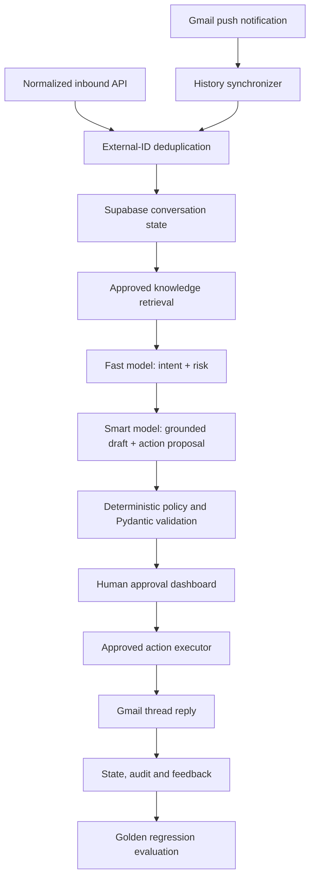

# Architecture

## Runtime path

The application is deliberately event-driven. Starting FastAPI creates provider
clients and serves HTTP; it does not schedule an AI loop. Work begins only when
Gmail Pub/Sub calls the webhook, a caller posts a normalized inbound message, a
reviewer requests regeneration, or an operator runs evaluation explicitly.

## Trust boundaries

1. Email text is always untrusted data and never placed in the system role.
2. Model output is a proposal and must pass Pydantic and policy validation.
3. Draft approval is claimed atomically before side effects, preventing two
   reviewers from sending the same draft.
4. The action executor accepts only enumerated actions and validated arguments.
5. Gmail and Supabase credentials remain server-side.

## Providers

The domain and service layers depend on protocols rather than SDKs. `mock`
providers make local demos and CI deterministic and free. `groq`, `gmail` and
`supabase` adapters activate through environment variables without changing the
workflow engine.

